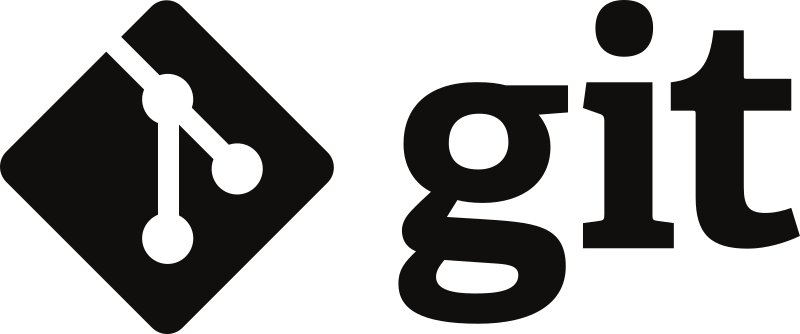

> # Оглавление
> ---
> 
> ## Консольные команды Git 
> <font size="6">**Управление репозиторием**</font> 
> 1. [Удаление  репозитория](#Удаление-репозитория)
> 2. [Работа с remote-репозиторием](#Работа-с-remote-репозиторием)
> 3. [Инфо о репозитории](#Инфо-о-репозитории)

> <font size="6">**Работа с ветками**</font>  
> 1. [Управление ветками](#Управление-ветками)
> 2. [Слияние веток](#Слияние-веток)
> 3. [Решение конфликтов при слиянии веток](#Решение-конфликтов-при-слиянии-веток)
> 3. [Удаленные (remote) ветки](#Удаленные-(remote)-ветки)

> <font size="6">**Тэги**</font> 
> 1. [Добавление](#Добавление)
> 2. [Удаление](#Удаление)

> <font size="6">**Работа с историей**</font> 
> 1. [Работа с историей](#Работа-с-историей1)

> <font size="6">**Коммиты**</font> 
> 1. [Коммиты](#Коммиты) 
> 1. [Соглашение о коммитах](#Соглашение-о-коммитах)
> 1. [Примеры коммитов](#Примеры)
---
# Консольные команды Git 

## Управление репозиторием
### Удаление  репозитория
* `-rm -rf .git` -  удалить текущий репозиторий
* `-rm -rf .git` - удалить текущий репозиторий включая .gitignore и другие системные файлы гита
* `git remote remove name` - удалить ремоут репозиторий *name* и привязку к нему
 
### Работа с remote-репозиторием
* `git clone https://www...` - клонирование репозитория
> после этого нужно зайти в скачанную папку - *cd c://...* или сделать Git Bash Here в скачаной папке
* `git push -u origin master` - отправить коммит в удаленный (remote) репозиторий *origin* в ветку *master*
> флаг `-u` связывает текущую ветку явно с конкретным ремоут репозиторием *master*
* `git push --all` - отправить все ветки в удаленный (remote) в репозиторий
---

## Инфо о репозитории
* `git log` - история коммитов
* `git status` - текущий статус
* `git remote -v` - инфо об удаленном (remote) репозитории

---

## Работа с ветками
### Управление ветками
* `git branch`- просмотр все существующих веток в репозитории в т.ч. ремоут
* `git branch name` - создать новую ветку с именем *name*
* `git checkout name` - переключиться на ветку с именем *name*
* `git checkout -b name` - создать и сразу переключиться на ветку с именем *name*
* `git checkout --track origin/name` - создать ветку с именем *name* которая сразу будет трекаться с веткой *name* в ремоут репозитории
* `git log --oneline --graph` - построить граф веток
* `git brach -d name` - удалить ветку с именем *name*


* `git branch -m *Новое название текущей ветки` - переименовать текущую ветку
* `git branch -m test head` - переименовать ветку *test* в ветку *head*. Мы в этот момент сидим в другой ветке.

> Для переименования ветки, загруженной на удалённый сервер, нужно вначале переименовать ветку локально, а затем выгрузить изменения обратно, удалив предыдущую ветку на сервере.
* `git push origin :старое_название новое_название` - двоеточие перед старым именем ветки — это команда для удаления ветки на сервере.

### Слияние веток
* `git merge --no-ff name` - слить из *name* в current branch
* `git merge --no-ff name -m 'сообщение'` - слить из *name* в current branch и добавть *сообщение*
### Решение конфликтов при слиянии веток
> После запуска `merge`, при наличии расхождений в сливаемых файлах запустится MERGING. После того как конфликт по строкам кода исправлен в редакторе, нужно приступить к мерджению в гите.
* `git add` - добавить в Staging Area изменный код
* `git commit -a -m 'fix: Merging...'` - закоммитить его
> Фактически решение конфликтов сводится к редактированию наложившихся друг на друга строк кода и коммиту этих изменений.
### Удаленные (remote) ветки
* `git fetch` - склонировать себе ремоут ветку из ремоут репозитория
* `git pull` - склонировать себе ремоут ветку из ремоут репозитория с разу начать смердживание ее с локальной веткой с аналогичным названием


---
## Тэги
### Добавление
> * `Git tag -a v.1.0 -m 'Версия 1.0'` - добавить к последнему коммиту тег *v.1.0* с названием *'Версия 1.0'* 
> * `Git tag -a v.1.0 -m 'Версия 1.0' <commit-id>` - добавить к коммиту с идентификатором *commit-id* тег *v.1.0* с названием *'Версия 1.0'* 
* `git push --tags` - отправить теги на  удаленный (remote) репозиторий
### Удаление
> * `git tag -d v.1.0` - удалить тег только из локального репозитория

Связка для удаления из удаленного (remote) репозитория:
> * `git push --delete origin v1.0` - удалить тег  *v1.0* из ветки *origin* в удаленном (remote) репозитории
>  * `git tag -d v.1.0` - удалить этот же из локального репозитория 

---
## Работа с историей
* `git log -p -- index.html` - посмотреть лог для файла *index.html*
*  `git log --grep 'Initial'` - грепать коммиты по слову *'Initial'* 
*  `git log -$'Page' -p` - грепать коммиты по куску кода *Page*
> По умолчанию грепается только текущая ветка. Чтобы грепать по всем нужно добавить флаг
> `--all`
* `git blame --index.html` - показать кто менял какие строки кода и когда в файле *index.html*
---
## Коммиты
* `git add index.html` - добавить фаил *index.html* в staging area
* `git add` - добавить все фаилы в staging area
* `git add *.js` - добавить все фаилы c расширением .js в staging area
* `git commit` - коммит без сообщения, будет работать только если в staging area есть изменения через git add
> крайне не желательно коммитить без добавления сообщения через флаг -m
* `git commit -m 'Message'` - комvит c сообщением *Message*, будет работать только если в staging area есть изменения через git add
*  `git commit -a -m 'Message'` - коммит c сообщением *Message*, будет работать если в staging area нет изменений, при этом сначала будет запущен git add *

## Работа с изображениями в Git-hub в Markdown
* Гитхаб работает только с .png или ссылками
* Можно вставлять ссылку на картинку, которая лежит в том же репозитории
* Картинки нужно выкладывать в подпапке
* Ссылка на картинку внутри маркдауна будет иметь вид ```` - в данном примере картинка Git-logo.png валяется в папке img 
* Ресайз средствами маркдауна не работает (напр.:```` - ресайзится до размера 30х30 не будет)


git rebase -i для редактирования истории коммитов
revert 


---
# Соглашение о коммитах
Слова «MUST», «MUST NOT», «REQUIRED», «SHALL», «MAY» и «OPTIONAL» в данном документе должны интерпретироваться как в [RFC 2119](https://www.ietf.org/rfc/rfc2119.txt).
1. Коммиты должны (MUST) начинается с типа, который является существительным: feat, fix и т.д. За ним следует необязательный (OPTIONAL) контекст, необязательный (OPTIONAL) восклицательный знак (!) и обязательные (REQUIRED) двоеточие (:) и пробел ( ).
1. Тип feat должен (MUST) использоваться, когда коммит добавляет новый функционал в ваше приложение или вашу библиотеку.
1. Тип fix должен (MUST) использоваться, когда коммит исправляет баг в вашем приложении или вашей библиотеке.
1. Контекст может (MAY) следовать после типа. Контекст должен (MUST) быть существительным, заключённым в круглые скобки, описывающий часть кодовой базы, которую затронул коммит. Например, fix(parser).
1. Описание должно (MUST) следовать сразу за двоеточием (:) и пробелом ( ) после типа или контекста. Описание представляет собой краткое изложение изменений кода. Например, fix: array parsing issue when multiple spaces were contained in string.
1. Тело коммита может (MAY) следовать после короткого описания, добавляя дополнительную контекстную информацию об изменениях в коде. Тело должно (MUST) отделяться от описания одной пустой строкой.
1. Тело коммита имеет произвольную форму и может (MAY) состоять из любого количества абзацев, разделённых новой строкой.
1. В одной или нескольких сносках может (MAY) быть одна пустая строка после тела. Каждая сноска должна (MUST) состоять из токена слова, за которым следует разделитель :<пробел> или <пробел>#, за которым следует строковое значение (основано на git trailer format).
1. Токен сноски должен (MUST) использовать - вместо пробельных символов. Например, Acked-by (это помогает отличить раздел сноски от его тела, состоящего из нескольких абзацев). Исключение составляет BREAKING CHANGE, которое может (MAY) также использоваться как токен.
1. Сноска может (MAY) содержать пробелы и символы новой строки, а считывание должно (MUST) завершаться при обнаружении следующей допустимой пары токен-разделитель сноски.
1. Критические изменения должны (MUST) быть указаны в типе, контексте или сноске коммита.
1. Если BREAKING CHANGE включено в сноску, то оно должно (MUST) состоять из прописного текста BREAKING CHANGE, за которым следует двоеточие (:), пробел ( ) и описание. Например, BREAKING CHANGE: environment variables now take precedence over config files.
1. Если критические изменения находятся в типе или контексте, то они должны (MUST) быть обозначены восклицательным знаком (!), непосредственно перед двоеточием (:). Если используется восклицательный знак (!), то BREAKING CHANGE может (MAY) быть опущен в сноске, а описание коммита должно (SHALL) использоваться для описания критического изменения.
1. В ваших сообщениях коммитов могут (MAY) использоваться типы, отличные от feat и fix. Например, docs: updated ref docs.
1. Единицы информации, которые составляют «Соглашение о коммитах», не должны (MUST NOT) обрабатываться разработчиками как чувствительные к регистру, за исключением BREAKING CHANGE, которое должно (MUST) быть прописными.
1. BREAKING-CHANGE должен (MUST) быть синонимом BREAKING CHANGE при использовании в качестве токена в сноске.

# Примеры
### Сообщение коммита с описанием и сноской BREAKING CHANGE
```
feat: allow provided config object to extend other configs

BREAKING CHANGE: `extends` key in config file is now used for extending other 
config files`
```
---
### Сообщение коммита с ! для привлечения внимания к BREAKING CHANGE
```
feat!: send an email to the customer when a product is shipped
Сообщение коммита с контекстом и ! для привлечения внимания к BREAKING CHANGE
feat(api)!: send an email to the customer when a product is shipped
```
---
### Сообщение коммита вместе с ! и сноской BREAKING CHANGE
```
chore!: drop support for Node 6

BREAKING CHANGE: use JavaScript features not available in Node 6.
```
---
### Сообщение коммита без тела
`docs: correct spelling of CHANGELOG`

---
### Сообщение коммита с контекстом
`feat(lang): add polish language`

---
#### Сообщение коммита с телом из нескольких абзацев и несколькими сносками
`fix: prevent racing of requests`

---
